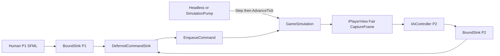

# Local AI opponent — implementation plan (issue #60)

Linked issue: [vivaHappyCrab/steel-conveyor-war#60](https://github.com/vivaHappyCrab/steel-conveyor-war/issues/60).

GDD §17: product AI is out of MVP; a scripted local opponent is useful for combat/victory loops. This document is the executable architecture for that first delivery.

**Status:** plan only. The issue stays `ai-blocked` until technologies, units, and balance freeze. Do not author a real opening book or ship bot policy until the issue is promoted to `ai-ready`. Then follow `.cursor/skills/task-to-pr` on branch `ai/60-ai-opponent-p2`.

This plan is **content-agnostic**: kinds, recipes, techs, template counts, and victory tick budgets are data slots filled at freeze time, not C# constants.

## Product locks (unchanged from the issue)

- AI seat is always Player 2 (`PlayerId(2)`).
- Supported map is the default seed only (`config/game.json` → `simulation.defaultRandomSeed`, currently 42; compare against `GameSimulation.RandomSeed`).
- Build approach: fixed blueprint book authored for that seed (P1-side coordinates + X-mirror for P2). No adaptive layout solver.
- First delivery: skeleton + opening economy + military loop ending in Bastion `AttackArea`.
- No cheat spawn / free units. Optional test-only helpers stay `internal` and must not be friended to the AI assembly.
- Non-default seed: disable / safe no-op + log; simulation remains valid.

## Specialists

| Area | Owner |
|------|--------|
| New `SteelConveyorWar.Ai` module | engine-architect |
| Queue / observation, no extra mutators | core-simulation |
| Blueprint executor | logistics-build |
| Template + `AttackArea` | combat-bastion |
| X-mirror helper | map-generation |
| Pump injection | sfml-platform |
| Cadence / seed / hash | multiplayer-correctness |
| JSON schema | modding-extensibility |
| Tests / CI evidence | test-ci |

## What in the issue is stale vs current code

The issue still draws immediate `GameSimulation.Try*` and “step after `AdvanceTick`”. Current contracts:

- **Production input** is `IPlayerCommandSink` → `DeferredCommandSink` (input delay = 1 tick) → `EnqueueCommand`. Immediate `Try*` remain for tests and rare host shortcuts. Fair bots must stay on the queue (R02, `docs/MVP_IMPLEMENTATION_DECISIONS.md`).
- **Observation** is `GameSimulation.CreatePlayerView(playerId, PlayerObservationMode.Fair)` + `IPlayerView.CaptureFrame()` (R19/M10). `World` / `GetPlayer` is cheat vision.
- **Headless** already runs a stub through the fair view and a bound sink (`HeadlessHostRunner`). Policy is hardcoded, not injectable. Comment in that type points at issue #60.
- **`AssignFactoryBastion` is obsolete** (handler always false; filtered from advertised vocabulary). Unit production is `SetFactoryProduction` + `SetBastionTemplate`; spawn picks the deficit bastion.
- **Client** binds one seat (`SfmlPlaySession` + `LocalPlayerBinding`). Player 2 exists in the roster but receives no sink. No CPU/AI CLI flag.
- **`SteelConveyorWar.Ai` does not exist.**

Keep the issue’s product locks; replace its architecture section with the loop below.

## Target architecture

Host loop (same as current Headless, not “after the tick”):

1. Build `AiStepContext` (tick, `simulation.RandomSeed`, this actor’s `LastTickCommandRejections`).
2. `controller.Step(view, boundSink, context)` — zero or one primary command plus optional cheap tweaks.
3. `AdvanceTick()` — a command stamped with delay 1 applies on the next tick, before systems.

Two `BoundPlayerCommandSink` instances wrap **one** `DeferredCommandSink`: shared replay log; per-actor sequence already exists in `DeferredCommandSink`.

Fair observation plus an **authored** attack target in the book (Player 1 commander start from the map roster / `MapPlayerDefinition.ResolveStartPositions`). That is the issue’s documented scripted knowledge for v1 — not `PlayerObservationMode.Cheat` and not reading `World`.

Do not put match seed or command rejections on `IPlayerView`. Seed is host-owned (`GameSimulation.RandomSeed`). Rejections are presentation-only (R09/R11) and must not enter the determinism hash.

## Content stays out of code

In C# and in the JSON schema, use slots, not balance facts:

- `kind` / `recipe` / `technology` are strings/ids, validated against the match catalog at execution time.
- Template `count`, cadence, and victory tick budget are data/test fields, not “T1 opening” constants.
- Skeleton tests use a tiny fixture book (1–2 steps), not the future seed-42 opening.

### Content-freeze checklist (human, before `ai-ready`)

Fill these in the book / test parameters; do not bake them into the controller:

- Opening building list (kinds + P1-side tiles + directions + optional recipes)
- Minimal research path (technology ids; empty list is valid)
- Factory output kind and bastion template (unit kind + count)
- `exitWhen` predicates for Bootstrap → Militarize → Pressure
- Authored attack target (`enemyCommanderStart` from roster, or an explicit tile)
- Tick budget T for “AI vs AFK Player 1 commander kill” (acceptance criterion; TBD until freeze)

## Phase 0 — module and contract (allowed before content freeze)

New `src/SteelConveyorWar.Ai` depending only on Core: no SFML, no Hosting file I/O, no `InternalsVisibleTo` on god-mode helpers. Tests: `tests/SteelConveyorWar.Ai.Tests`.

Public surface (names may vary slightly):

- `IAiController.Step(IPlayerView view, IPlayerCommandSink sink, in AiStepContext ctx)`
- `AiStepContext(long Tick, int MatchSeed, IReadOnlyList<CommandRejection> OwnRejectionsLastTick)`
- `AiRuntimeOptions`: `PlayerId` (default 2), `SupportedSeed`, `CadenceTicks`, `AiSeed` (deterministic RNG, never wall-clock), `PlayerObservationMode` (production = Fair)
- `NoOpAiController` — seed ≠ supported, or policy disabled
- `ScriptedAiController` — FSM + executor; book injected from outside (empty/fixture until freeze)

Step rules:

- **Primary** (at most one per cadence): move / queue build / demolish.
- **Cheap** (may batch even when the commander is busy): research, factory production, bastion template/order, recipe/rotate.
- **Busy-gate:** `Own.MoveTarget` / `QueuedBuildOrder` / `QueuedDemolishOrder` on the observer’s Commander from `CaptureFrame`.
- Never call `Try*`. Never read `World`. Never enqueue `AssignFactoryBastion`.

Tests: wrong seed → zero enqueues; cadence skips ticks; bound sink throws on foreign `Actor`; two fixture runs → identical command log.

## Phase 1 — injectable Headless

`HeadlessHostRunner.Run` takes an `IAiController` (default = current stub move so CI `dotnet run --project src/SteelConveyorWar.Headless -- --ticks 90` stays green). Move the stub into Ai as `IdleNudgeAiController`, or keep it as an internal fallback.

CLI: `--ai` / `--no-ai`, `--ai-player 2`. Seed comes from the already-created simulation (`content.CreationOptions` / `simulation.RandomSeed`).

Loop: Step then `AdvanceTick`. Create the fair view once, reuse it.

## Phase 2 — book schema and X-mirror (no real opening)

Schema for `config/ai/opening_seed42.json` (parse in Core or Ai; file I/O in Hosting, same as other config):

- `schemaVersion`, `supportedSeed`, `mirror: "x"`
- phases with free ids; conventional ids `bootstrap` | `militarize` | `pressure`
- `builds[]`: `{ kind, x, y, direction?, recipe? }` — coordinates on the **authored Player 1 side**
- `research[]`, `factoryProduction`, `bastionTemplate`, `bastionOrder`
- `exitWhen`: predicates over own snapshots (own kind present, research completed, template non-empty) — no balance numbers in code

X-mirror for Player 2 (same geometry as terrain/solar and fallback seats in `MapPlayerDefinition.ResolveStartPositions`): `x' = width - 1 - x`; East ↔ West for directed belts/inserters. Helper in Ai (or a public Core util) plus involution tests.

Executor: skip a build step if the tile already has the observer’s ghost or building of that kind (`VisibleEntitySnapshot`, including `GhostBuild`). Otherwise enqueue `QueueCommanderBuildCommand`.

Hosting copies `config/ai/**` to output (same pattern as `config/*.json` in Client/Headless csproj). Missing or empty book: controller stays valid and builds nothing.

## Phase 3 — economy and militarization (logic, not roster)

FSM:

1. **Bootstrap** — walk `builds` + `research` until `exitWhen` is true.
2. **Militarize** — `SetBastionTemplate` + `SetFactoryProduction` (no assign). `IssueBastionOrder(Defend)` until the army-present predicate in the book is true (do not hardcode a unit kind).
3. **Pressure** — `IssueBastionOrder(AttackArea, target)`. Target is `enemyCommanderStart` from the match roster (host binds it into context/book), not a live fog position.

Minimal research is the id list in the book; an empty list means the phase never sends `SelectResearchCommand`.

## Phase 4 — Client Player 2

- Flag `--cpu` (or `--ai`): enable the Player 2 controller when `simulation.RandomSeed == SupportedSeed`; otherwise log and no-op; the match stays valid.
- In `SimulationPump.AdvanceFixedSteps`: on **every** sim tick (including catch-up, cap ≤ 8) run Player 2 `Step` **before** `AdvanceTick`, mirroring Headless. Do not bind AI to the window frame.
- Human keeps `BoundPlayerCommandSink(P1)`; AI is a second bound wrapper on the same deferred sink.
- `--smoke-test` need not play a full match; the flag must not crash in the 3-tick smoke.

Sfml depends on `IAiController` only, not on a concrete policy. Client is the composition root (same as Headless).

## Phase 5 — scenarios and determinism

- Headless: Player 2 scripted vs idle Player 1, fixed seed, two runs → identical `CommandLog` (canonical payload) and/or `ComputeStateHash`.
- Victory: “AFK Player 1 commander kill within budget T” — `T` is a test/book parameter, TBD at freeze. Until freeze, assert that pressure actually enqueues `IssueBastionOrder(AttackArea)`, not a win.
- Non-supported seed: zero build/attack commands; hash matches a run with no AI.
- Verification: `pwsh eng/verify.ps1` plus `dotnet test tests/SteelConveyorWar.Ai.Tests -c Release` (and/or `--filter AI`).

## Phase 6 — product docs (on the implementation PR, not this plan PR)

Update `docs/MVP_IMPLEMENTATION_DECISIONS.md` with the shipped facts: Player 2 only, seed lock, queue + fair view, blueprint + mirror, non-default no-op, scripted attack target, do not use `AssignFactoryBastion`. Short GDD §17 note: scripted test opponent, not product AI.

## Explicit non-goals

- Adaptive layout, other seeds, seats other than Player 2, difficulty tiers, ML, networked AI
- Product-quality FoW scouting as a gate (the book knows Player 1’s start)
- Extending `IPlayerView` for seed/rejections (host `AiStepContext` instead)
- Friending the AI assembly to god-mode helpers
- Shipping AI before the content freeze

## Risks

- Implementing policy before freeze churns the book — this document exists so architecture can freeze independently of balance.
- Fair view cannot see Player 1’s base until scouted — the attack tile must be authored.
- Input delay = 1: a command issued on step T applies at T+1; cadence tests must account for that.
- Without `AiStepContext.OwnRejectionsLastTick` the bot cannot see enqueue failures (optimistic enqueue).

## Implementation gate (when unblocked)

1. Human fills the content-freeze checklist and authors `config/ai/opening_seed42.json`.
2. Remove `ai-blocked`, add `ai-ready`.
3. Follow `.cursor/skills/task-to-pr` on `ai/60-ai-opponent-p2` from latest `develop`.
4. Draft PR → `develop`; human merge only.
